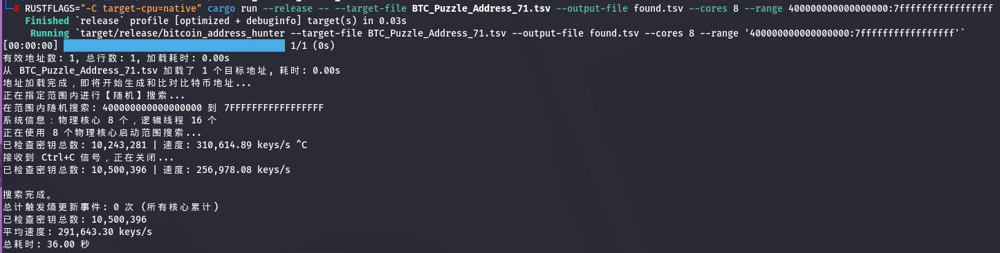
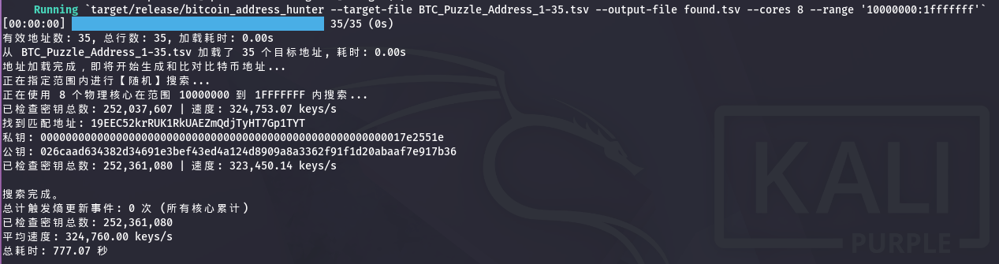

(Note: Please try to run it on Linux/Unix.)

# High-Performance Bitcoin Private Key Collider in Rust

This is a high-speed Bitcoin private key search tool engineered in Rust. Designed to maximize the computational throughput of modern multi-core CPUs, this program generates private keys via brute-force or random entropy and checks them against a target dataset of Bitcoin addresses.

Key Features:

Replicates the private key generation process of the Bitcoin Core wallet. It utilizes OS-level strong entropy (CSPRNG) mixed with SHA-256 for seed initialization and generates independent cryptographic-grade random streams via the ChaCha12 algorithm.

Extreme Performance: Built on the optimized secp256k1 library, leveraging SIMD (AVX2) and SHA hardware instruction sets to maximize hash rates.

Massive Parallelism: Automatically detects CPU topology to launch multi-threaded workers, fully utilizing 100% of available resources on AMD Ryzen and Intel Core processors.

Memory Efficiency: Implements Bloom Filters to handle massive target lists (target_addresses.tsv) with minimal memory footprint, ensuring ultra-fast O(1) lookups.

IO-Free Logic: Operates purely in-memory after initialization to eliminate disk I/O bottlenecks.

Disclaimer: This tool is strictly for cryptographic research and educational purposes. Do not use for illegal activities.

## RUST(This version is recommended.)

# Instructions

    cargo run --release -- --target-file BTC_Puzzle_Address_71.tsv --output-file found.tsv --cores 8 --range 400000000000000000:7fffffffffffffffff

    #Let the compiler generate the most optimized instruction set (e.g., AVX2, AVX-512, etc.) for the CPU you are using, which can improve stability.
    RUSTFLAGS="-C target-cpu=native" cargo run --release -- --target-file BTC_Puzzle_Address_71.tsv --output-file found.tsv --cores 8 --range 400000000000000000:7fffffffffffffffff

    --help
        Print help

## Support me!

    BTC：
    
    bc1q8np6jeglpgju7ex5z6mvsmllzwhxqzytymwlv7
    
    LTC：
    
    LTzSaAtCvAhjRYJHSFPjmqustpYRCypXxL
    
    USDT、USDC:
    
    TRC20:
    TXdmK7Dd5UjWbfutoiHDGLBub4hYjbWteg
    
    Arbitrum One:
    0xceF4D9ae284AB6f836dB20C851c3631fe2eCCc72
    
    Aptos：
    0x3f7d7a503dcd26915d93af18f3deaf7108a29b7e517e627782882d313835f00b
    

